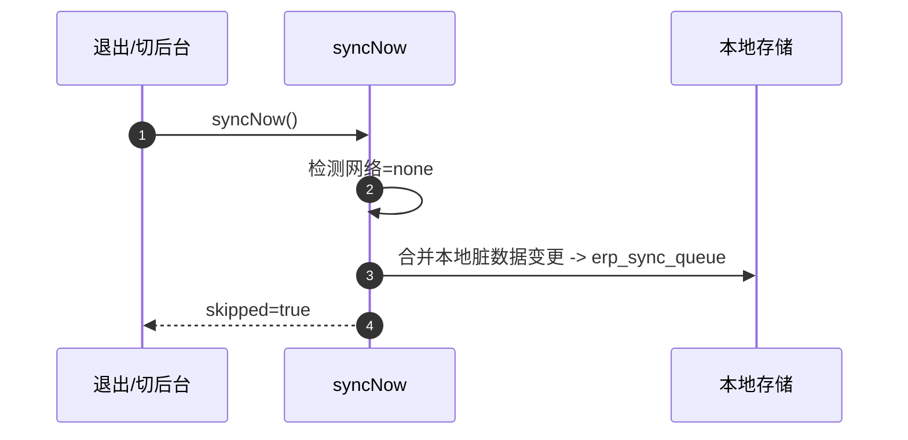
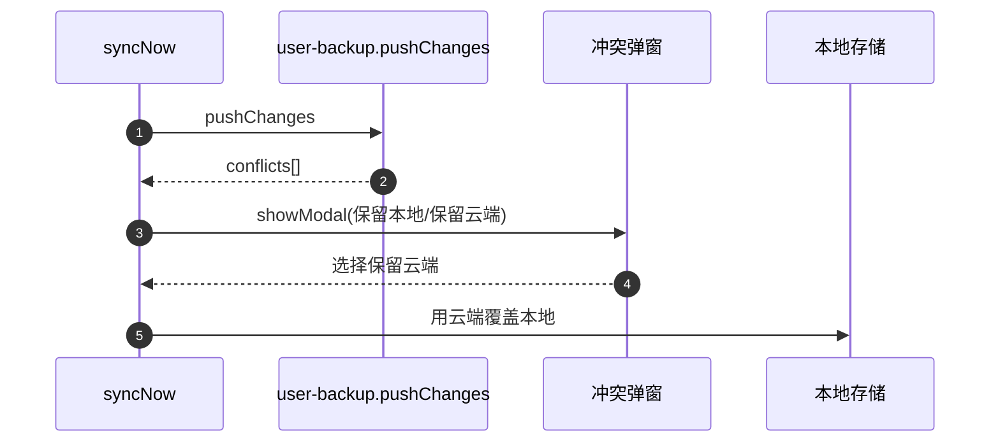

# 异常处理与冲突解决策略（小程序端同步/备份）

## 总体原则

- 本地优先：任何云端失败不应阻断本地业务操作
- 可恢复：失败要么入队、要么可重试，最终一致
- 可解释：用户能看懂“为什么冲突/为什么跳过”，并可选择保留本地或云端

## 异常分类与处理

### 1) 网络不可用

触发点：

- 登录前 `pullAllCloudData`
- 退出/切后台 `syncNow`
- 定时/手动备份 `exportEncryptedBackup`（定时模式额外要求 Wi‑Fi）

处理策略：

- `pullAllCloudData`：直接抛出 `code=NETWORK_OFFLINE`，由“云端数据加载页”展示错误并提供重试
- `syncNow`：返回 `{ success:false, skipped:true, message:'网络不可用' }`
  - 自动将“离线队列 + 本地脏数据推导变更”合并写入 `erp_sync_queue`
- `exportEncryptedBackup`：
  - 定时模式：非 Wi‑Fi 返回 `{ skipped:true }`（不重试，延后执行）
  - 手动模式：按重试策略重试，最终失败由 UI 提示

### 2) 云函数失败/返回格式不符合预期

触发点：

- `wx.cloud.callFunction` 返回 `success !== true`
- `res.result` 缺失或 payload 结构异常

处理策略：

- 所有云函数调用都走重试包装 `withRetry`
- 超过重试次数仍失败：抛错或返回失败（由上层页面/生命周期处理）

重试策略（当前实现）：

- 指数退避：`baseDelayMs * 2^attempt`
- 默认重试次数：3 次

### 3) 本地存储失败

触发点：

- `wx.setStorageSync` / `wx.getStorageSync` 抛异常（空间不足、权限、系统错误）

处理策略：

- 本地读写均 try/catch，尽量返回可用默认值或失败标记
- 关键路径（备份元信息写入）失败时，不影响主流程返回成功

建议补强（可选）：

- 在设置页提示“本地空间不足”，引导用户清理缓存/卸载重装

### 4) 冲突（双向修改）

触发点：

- 上行同步 `pushChanges` 返回 `conflicts[]`
- 或登录合并云端数据时出现“本地脏 + 云端更高版本”

处理策略：

- 弹窗让用户选择：
  - 保留本地：不覆盖本地；上行可在下次同步时再次尝试
  - 保留云端：用云端覆盖本地

冲突最小信息集：

- `collection`
- `id`
- `local`（本地版本）
- `cloud`（云端版本）

## 冲突解决算法细节

### 上行冲突判定（云函数）

判定条件（同一条记录）：

- 服务器当前版本 `serverTs = computeCloudModifyTime(remote)`
- 客户端已知云端版本 `clientKnownCloudTs`
- 客户端本地修改时间 `clientLocalTs`

若同时满足：

- `serverTs > clientKnownCloudTs`
- `clientLocalTs > clientKnownCloudTs`

则认定为双向修改冲突，返回 `conflicts`，不覆盖云端。

### 下行合并冲突判定（小程序端）

判定条件（同一条记录）：

- 本地脏：`localModifyTime > cloudModifyTime(local)`
- 云端更新：`cloudModifyTime(cloud) > cloudModifyTime(local)`

满足则弹窗选择云端或本地。

## 数据一致性与回滚

### 一致性保证层级

- 弱一致（默认）：离线可写 + 最终一致
- 强一致（可选场景）：关键操作（例如库存扣减）可在云端加事务/锁

### 回滚建议（可选）

- “导出备份”可视为可回滚点
- 建议增加“导入备份”工具（需权限校验 + 二次确认 + 校验和）

## 时序图：典型异常场景

### 退出同步时离线

### 上行冲突：用户选择云端

## 用户提示规范（建议）

- 统一文案：
  - 网络不可用：提示“已离线保存，联网后将自动同步”
  - 冲突：提示“检测到双向修改，请选择保留本地或云端”
  - 定时备份跳过：提示“仅 Wi‑Fi 下执行定时备份”

