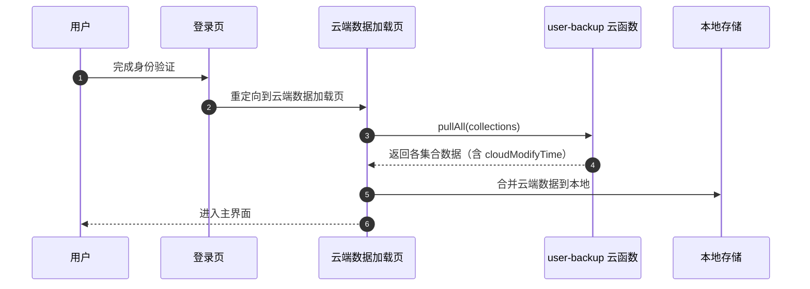
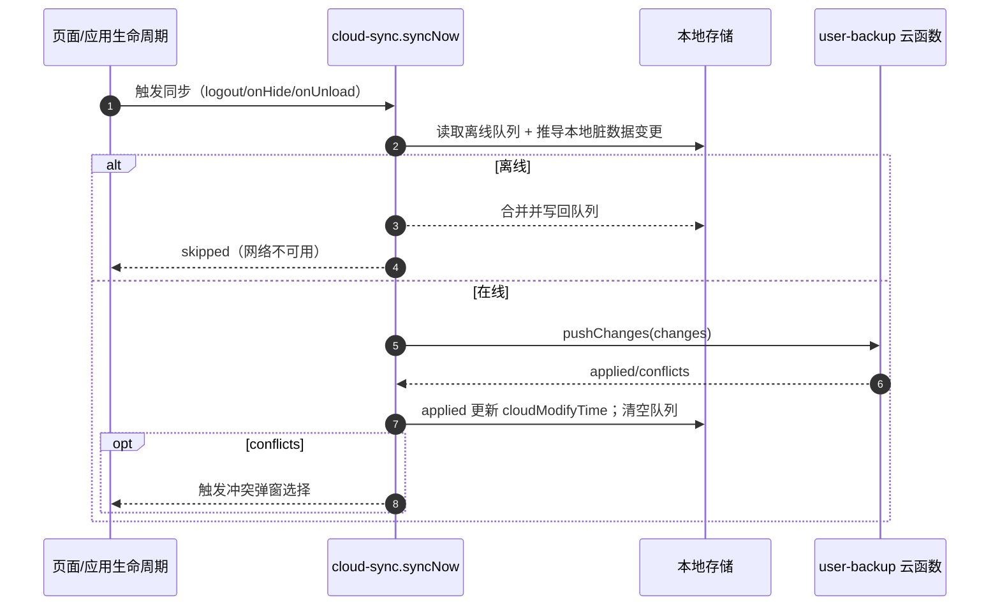
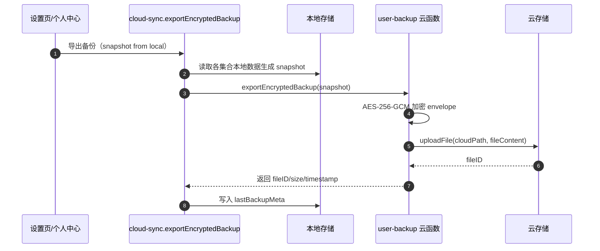

# 数据同步与备份设计文档（小程序端）

## 目标

- 登录进入主界面前，强制执行“云端数据加载”，保证本地数据为最新可用版本
- 本地优先：业务读写走本地缓存，离线可用；联网后差异化上行同步
- 退出/切后台/卸载前触发自动同步，尽量减少丢数据概率
- 支持导出加密备份（AES-256-GCM），可用于审计与灾备

## 范围与数据模型

### 同步范围（默认）

同步集合清单由 [sync-collections.js](file:///g:/ERP-cursor/utils/sync-collections.js) 定义，默认包含：

- users、userConfig、orders、customers、products 等

### 本地存储结构

本地数据以 `wx.setStorageSync` 存储，集合按前缀分桶：

- 业务数据：`erp_local:<collection>`
- 元信息：`erp_local_meta`
- 离线队列：`erp_sync_queue`

实现位于 [local-store.js](file:///g:/ERP-cursor/utils/local-store.js)。

每条本地记录会携带：

- `localModifyTime`：本地最后修改时间（毫秒时间戳）
- `cloudModifyTime`：最后一次确认的云端版本时间（毫秒时间戳）

判定“脏数据”：

- `localModifyTime > cloudModifyTime` 视为需要上行同步

## 核心模块

### 1) 云端同步与备份工具

[cloud-sync.js](file:///g:/ERP-cursor/utils/cloud-sync.js) 提供：

- `pullAllCloudData()`：登录前拉取云端数据并合并到本地
- `syncNow()`：差异化上行同步（队列 + 由本地脏数据推导的变更）
- `enqueueUpsert()` / `enqueueDelete()`：本地写后入队
- `exportEncryptedBackup()`：导出加密备份到云存储并写入元信息

### 2) 云函数：user-backup

[user-backup/index.js](file:///g:/ERP-cursor/cloudfunctions/user-backup/index.js) 支持：

- `pullAll`：按 `_openid` 拉取指定集合数据并补齐 `cloudModifyTime`
- `pushChanges`：按变更列表 upsert/delete，包含冲突检测
- `exportEncryptedBackup`：加密快照并上传至云存储，记录到 `userBackup` 集合

## 关键流程

### 登录前“云端数据加载”

合并策略（单条记录）：

- 若本地不存在：直接写入本地
- 若本地存在：
  - 本地不脏且云端版本更高：云端覆盖本地
  - 本地脏且云端版本更高：弹窗提示用户选择保留本地或云端

### 退出/切后台/卸载前自动同步

### 加密备份导出（手动/定时）

定时备份约束：

- 定时模式仅在 Wi‑Fi 下执行（避免流量与耗电）

## 冲突检测（上行）

在 `pushChanges` 中：

- 客户端上送 `cloudModifyTime`（客户端已知的云端版本）
- 服务器计算当前远端 `serverTs`
- 若：
  - `serverTs > clientKnownCloudTs`
  - 且 `clientLocalTs > clientKnownCloudTs`
  - 则判定为冲突，返回 `conflicts[]`

## 备份加密

算法与封装：

- 算法：AES-256-GCM
- 输出 envelope 字段：`algo`、`iv`、`tag`、`data`（均为 base64 字符串）

密钥来源：

- 云函数通过环境变量 `BACKUP_AES_KEY` 获取
- 支持 base64/hex/明文（明文会被 sha256 派生为 32 字节 key）

## 验收与观测

### 单测覆盖

同步与备份核心逻辑的定向覆盖报告输出：

- `npm.cmd run test:sync-coverage`
- 覆盖报告目录：`app/backend/coverage-sync`

### 运行时观测（建议）

- 记录同步开始/结束、上传条数、冲突次数、失败原因
- 对“离线队列长度”设置告警阈值，提示用户联网同步

